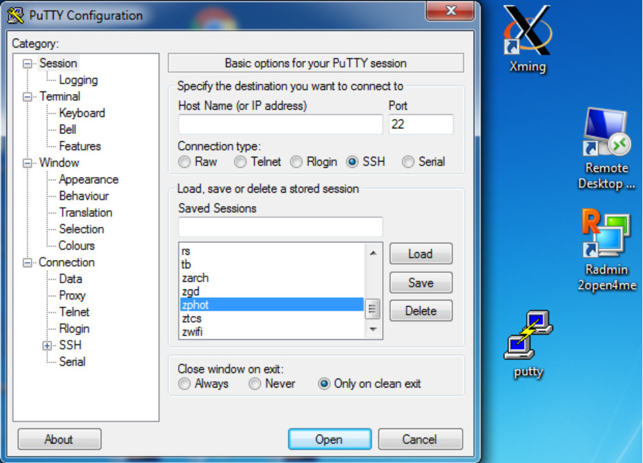
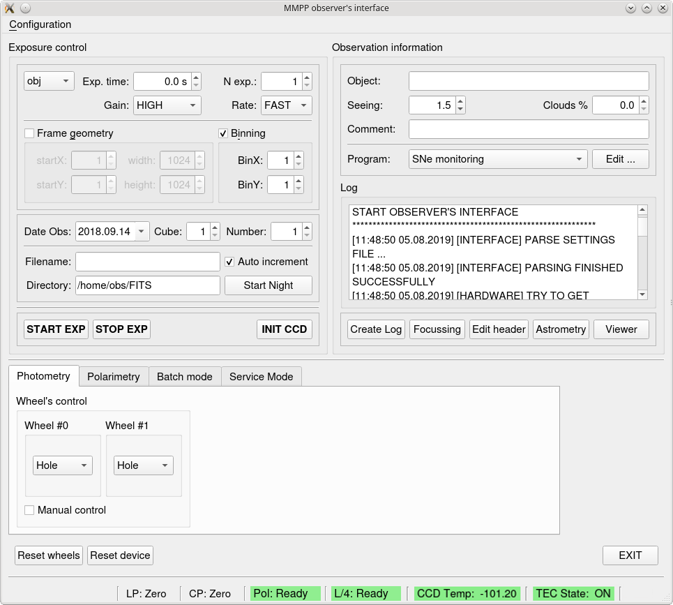
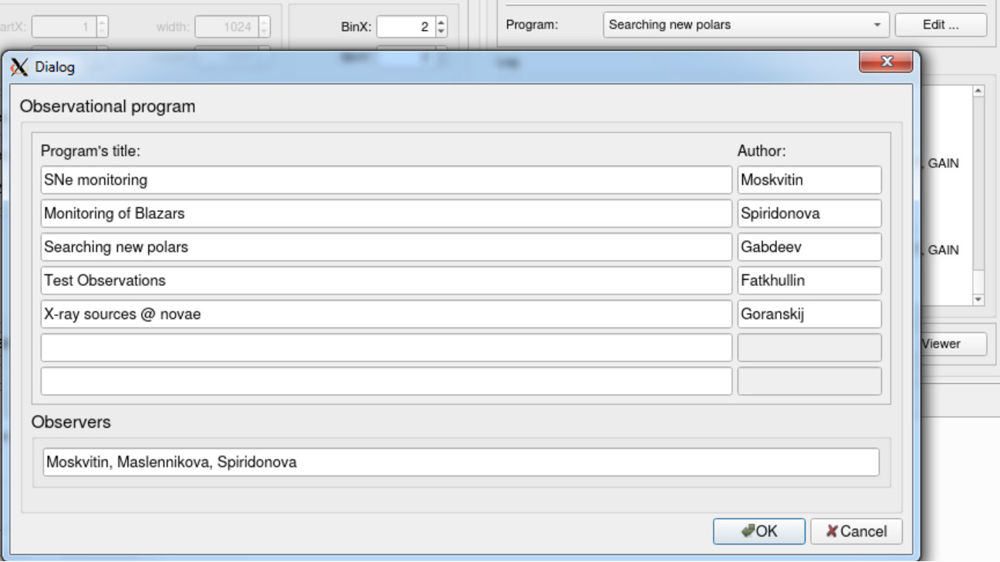
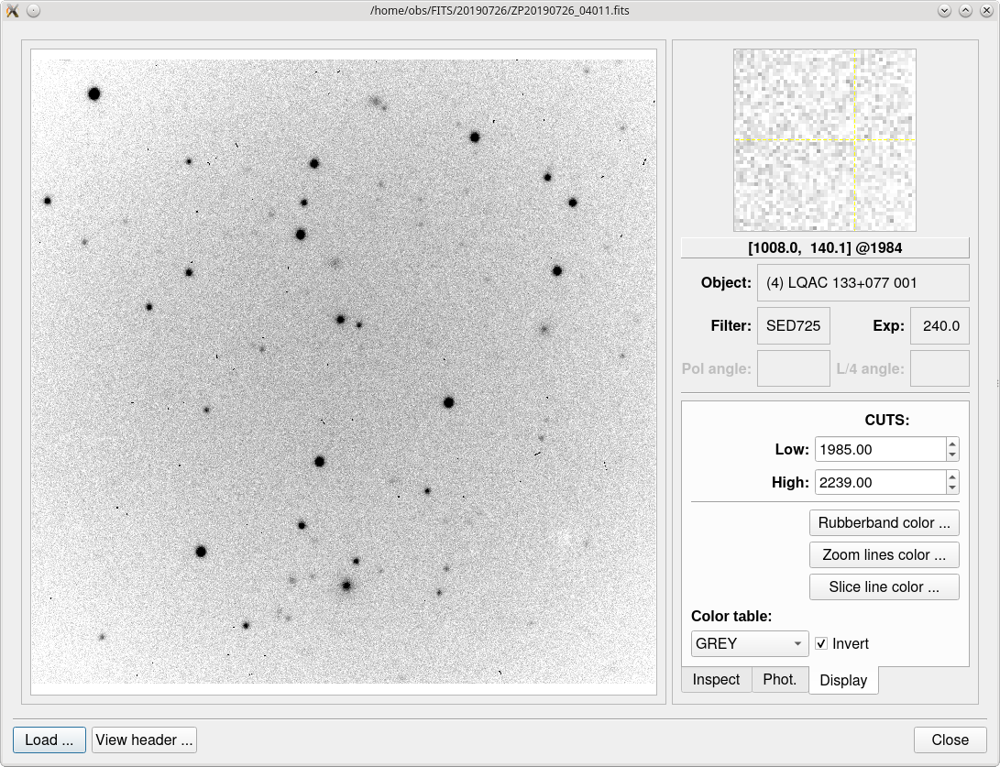

# Руководство наблюдений с многорежимным фотометром-поляриметром (MMPP) телескопа Цейсс-1000

## Многорежимный фотометр-поляриметр MMPP

Многорежимный фотометр-поляриметр (Multi-Mode Photometer-Polarimeter, MMPP) 
предназначен для получения прямых изображений, изучения линейной и круговой поляризации космических объектов.
Прибор устанавливается в фокусе Кассегрена метрового телескопа САО РАН Цейсс-1000
и комплектуется камерой с жидкостным охлаждением Raptor Photonics Eagle V. 
Две турели по пять позиций могут использоваться с высокоэффективными интерференционными фильтрами 
широкополосной системы Джонсона-Коузинса (производства Astrodon),
а также со средне- и узкополосными фильтрами диаметром 50-мм.
Для проведения полириметрических исследований используются анализатор линейной поляризации и четвертьволновая пластина.

Технические испытания прибора были проведены в 2018 году. 
В 2019 году наблюдения на MMPP внесены в штатное расписание метрового телескопа.
Через некоторое время были замечены проблемы с поддержанием рабочей температуры камеры.
После их разрешения во второй половине 2021 года прибор вернули в эксплуатацию.

## Подключение к управляющему MMPP компьютеру zphot

1. Проведение этапов подготовки к наблюдениям на MMPP проводится аналогично работе со старым ПЗС-фотометром Цейсс-1000.

2. Для запуска программы управления MMPP необходимо кликнуть значок Putty на рабочем столе основного компьютера 

*Иконка Putty и окно выбора подключения к удалённой машине zphot.*

3. В открывшемся окне Putty Configuration в правом нижнем поля Saved Sessoind 
 двойным щелчком выбрать машину zphot (ближе к концу списка), либо выделить одиночным щелчком и нажать кнопку Open.
 
4. В открывшемся окне терминала авторизоваться на Linux-машине zphot.

5. Если наблюдатель работает из системы Linux, можно воспользоваться SSH-протоколом: 

$ ssh -Y ******@zphot.sao.ru

6. Запустить оболочку управления MMPP:

  $ cd ~/MMPP_config

  $ ZPhot &

## Получение изображений и работа в фотометрическом режиме MMPP

1. **Работа в ZPhot.**  В открывшемся окне оболочки MMPP observer's interface 
  выбрать в выпадающем календаре дату начала ночи Date Obs, проверить, 
  что путь к директории в графе Directory оканчивается выбранной ночью, 
  и нажать Start Night.

*Внешний вид оболочки управления MMPP Observer's interface. Основные органы управления: поля параметров кадра (Exposure сontrol), информация об объекте и наблюдательных программах (Observation information), журнал работы прибора (Log). Под ними располагается ряд управляющих конопок: запуск экспозиции (START EXP), её остановка (STOP EXP), инициализация ПЗС (INIT CCD), создание журнала ночи (Create Log), ... Ниже имеются вкладки режимов работы прибора: фотометрического, поляриметрического, пакетного и сервисного, где могут быть выставлены необходимые конфигурации фильтров и анализаторов поляризации. В нижней части окна представлена информация о состоянии узлов прибора.*

2. Инициализировать камеру, нажав кнопку **INIT CCD**

3. Заполнить диалог выбора наблюдательных программ, вызвав его в поле Program кнопкой Edit. 
  Ввести названия и авторов программ, наблюдателей, нажать кнопку Ok.
  Выбрать программу из только что сохранённого выпадающего списка.
  

*Диалог выбора наблюдательных программ.*

4. Начиная с левого верхнего угла окна выбрать параметры будующего кадра.

**В поле Exposure Control выбираются:**

   тип кадра (obj, flat, bias, dark, ...);
   
   время экспозиции в секундах Exp. time;
   
   количество кадров в серии N. exp.;
   
   квант преобразования Gain (HIGH, LOW);
   
   скорость считывания Rate (FAST, SLOW);  
   
   включается и настраивается режим бинирования матрицы (BinX, BinY).  

**В Date Obs. выбираются:**

дата начала наблюдений;

номер куба (блока с данными для одного объекта) в поле Cube;    

номер файла устанавливается в поле Number;

правильность имени файла: /home/obs/FITS/20190109/ZP20190109_01001.fits;

галочка в поле Auto increment для автоматической нумерации следующего файла.

5. В нижней вкладке **Photometry** выбрать фильтр. 
Если не стоит галочка в боксе Manual Control, значит турели автоматически согласованы.

6. Нажать кнопку начала экспозиции **START EXP**, начнётся отсчёт времени до конца экспозиции.  
  Кнопка **STOP EXP** останавливает как отдельный кадр, так и серию.

7. Диск компьютера zphot, на который производится сохраниение изображений, отображается на управляющем компьютере (с небольшой задержкой). В момент начала экспозиции оболочка управления MMPP сразу создаёт fits-файл, а затем записывает в него описание ("шапку" файла с дескрипторами) и изображение. Не открывать этот файл до окончания записи, чтобы избежать его повреждение! Если открыт просмотрщик оболочки MMPP (вызывается кнопкой Viewer из основного окна оболочки MMPP) полученное изображение автоматически загрузится и будет доступно для анализа.

*Просмотрщик оболочки MMPP. Позволяет посмотреть изображение и описание файла, получить статистику по кадру, построить профили объектов, оценить качество изображений, провести быструю фотометрию интересующих объектов.*

8. Визуализация и быстрый анализ получаемых кадров может проводиться с помощью просмотрщика, либо во внешних программах ds9 и MaximDL (соответствующие иконки находятся на рабочем столе управляющего компьютера).

## Фокусировка